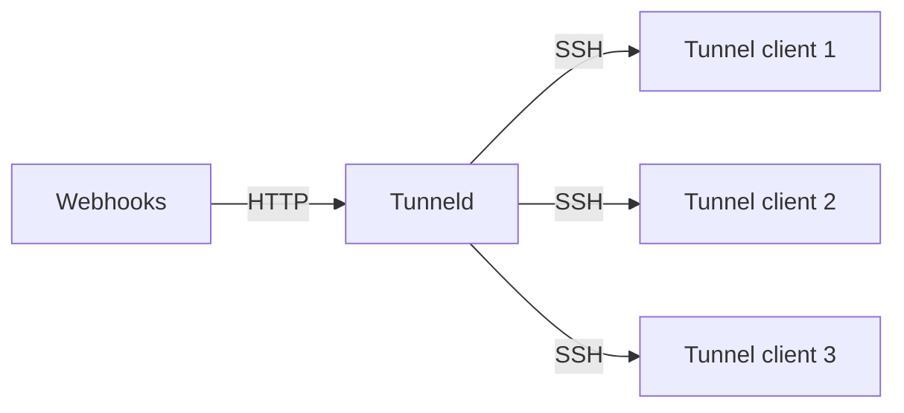

# tunneld
A multi-developer http tunneling client/server.  
Centralized tunneld server to receive webhooks and forward them to multiple tunnel clients (developers).  



## Tunnel client usage

```bash
tunnel \
    --registry <tunneld-server-address> \
    --host <local-dev-server-address> \
    --port <local-dev-server-port>
```
Options can be configurated via yaml file, defaulting to `~/.config/tunnel/tunnel.yaml`, or `./tunnel.yaml`.  
Refer to `examples/tunnel.yaml` for an example configuration file.


## Tunneld server usage
`tunneld registry` start a tunneld registry server.  
`tunneld proxy` start a tunneld proxy server receiving http webhooks.  
`tunneld standalone` start a tunneld standalone server containing a registry and embedded http proxy.  

refer to `examples/tunneld.yaml`, for an example configuration file.  

The registries host key will be automatically generated on first start and stored in the `registry.ssh.host_key_path` directory.  

### Keystores
Keystores are used to authenticate tunnel clients.
- GitHub organizations, all public keys of members will be allowed to connect.  
 (:exclamation:new organization members/public keys currently require a server restart)
- Yaml configuration, a list of allowed public keys.
